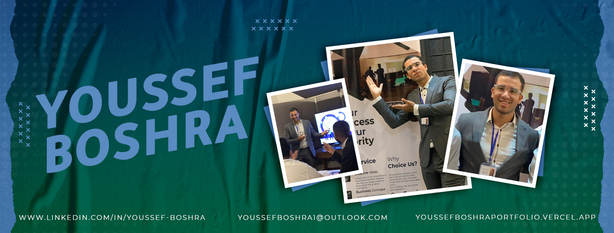

<h1 align="center">Hello I'm Youssef Boshra</h1>

  

 

## 👨🏻‍💻 About Me:

- 🙋‍♂️ All about me is at **[My Website](https://youssefboshraportfolio.vercel.app/)**

- 🔭 I’m currently working on `Front-End Projects with React.js and Node.js`.

- 🌱 I’m currently expanding my skills in `Backend Development` and `Cloud Technologies`.

- 👯 I’m looking to collaborate on `Innovative Web Applications`.

- 🤔 I’m seeking mentorship in `Advanced Software Architecture`.

- 💬 Ask me about `React.js`, `Tailwind CSS`, or `Performance Optimization`.

- 👨‍💻 Life Hack: Never stop building and learning 🚀.

- ⚡ Fun fact: My code runs smoother after a coffee ☕.

## 🛠️ Technologies and Tools I use:

 

 
 

## 💼 Work Experience:

  

- 🚀 **Frontend Developer, Emirate Digital Craft**  
  Built and optimized user-facing features for a large e-commerce platform using React.js and Tailwind CSS.  
  **Impact:** Achieved a 25% improvement in page load time and a 15% increase in user engagement.

- 🌟 **Frontend Developer Intern, Digital Egypt Pioneers Initiative (DEPI)**  
  Contributed to web applications using HTML, CSS, JavaScript, React, and TypeScript.  
  **Impact:** Improved team productivity by 15% and strengthened backend knowledge with Node.js.

- 🏆 **Frontend Development Intern, Sprints**  
  Delivered scalable web applications with Tailwind CSS and React.js, participating in Scrum sprints.  
  **Achievement:** Completed 100% of tasks within project deadlines.

- 💡 **Frontend Development Intern, Route**  
  Focused on creating reusable components and managing state with React Hooks.  
  **Impact:** Reduced application load times by 20%.

## ❤️ Let's get connected:

